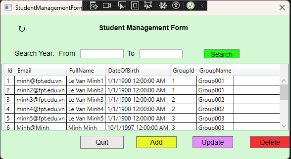
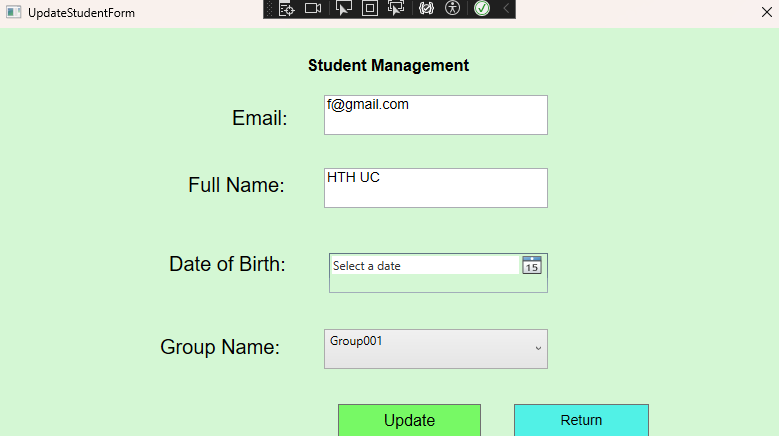
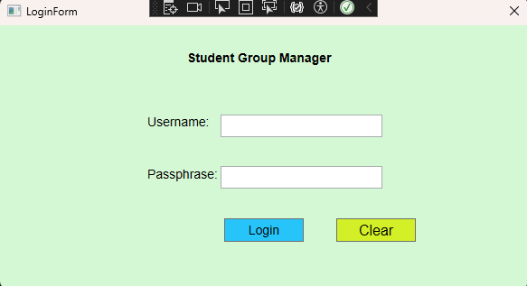

- **GUIs:**

  - **Main Window**  
       

  - **Edit**  
       

    - **Login**  
       

### MEMBER:

- Nguyễn Kiến Minh \_ SE171069 (Member/Main Back-End Dev and Front-End Dev, UI designer)

## I. REQUIREMENT:

### Name of your system:

Student Management

### What is the purpose of the system: (DESCRIBE)

- Purpose: Manage Student
- Describe: A WPF/ C# application to manage student, such as: create students, update student, Search date of birth, ...

### Who use the system:

Admin and Staff

### List all features system:

### Admin and Staff:

- CRUD students
- Search Students

### System Design:
- Front-end and Back-end: WPF, C#
